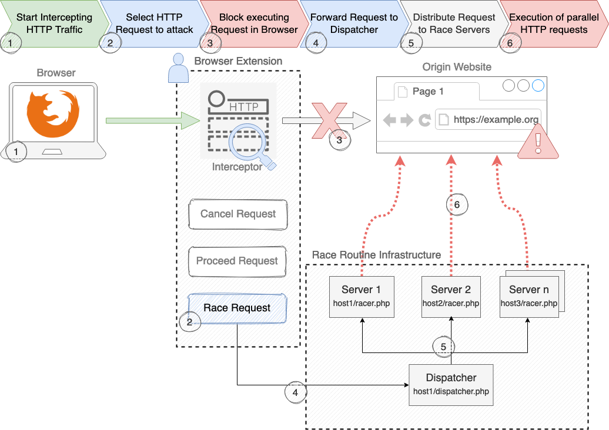

# Race-o-cat 
> Make exploiting race conditions in web applications highly efficient and ease-of-use.

## Overview

- [Quickstart](#quickstart)
- [Architecture Overview](#architecture-overview)
- [List of Projects](#list-of-projects)
- [License](#license)
- [Contributing](#contributing)
- [Author Information](#author-information)

## Quickstart

## Architecture Overview

## List of Projects  

### - [Browser Extension for Firefox](./browser-extension/README.md#Usage)
Firefox browser extension for live request monitoring and intercepting the desired request which will be forwarded to the Race Dispatcher.

### - [Race Routine Infrastructure](./race-routine-infrastructure/README.md#Race-Routine-Infrastructure)
Race Dispatcher and Race Script to execute parallel requests against any given endpoint.

### - [OWASP Zed Attack Proxy (ZAP) Extender](./zap-extender/README.md#Overview)
ZAP Extensions to test for Race Conditions.

### - [Vulnerable web application](./vuln-webapp/)
A web application with typical vulnerable use cases such as withdrawing money or excessive poll votes. 

## License
Code of Raceocat is licensed under the Apache License 2.0.

## Contributing

Feel free to open issues / pull requests if you want to contribute to this project.

## Author Information

You can reach me by email at javan.rasokat+raceocat@owasp.org or on Twitter [@javanrasokat](https://twitter.com/javanrasokat).
