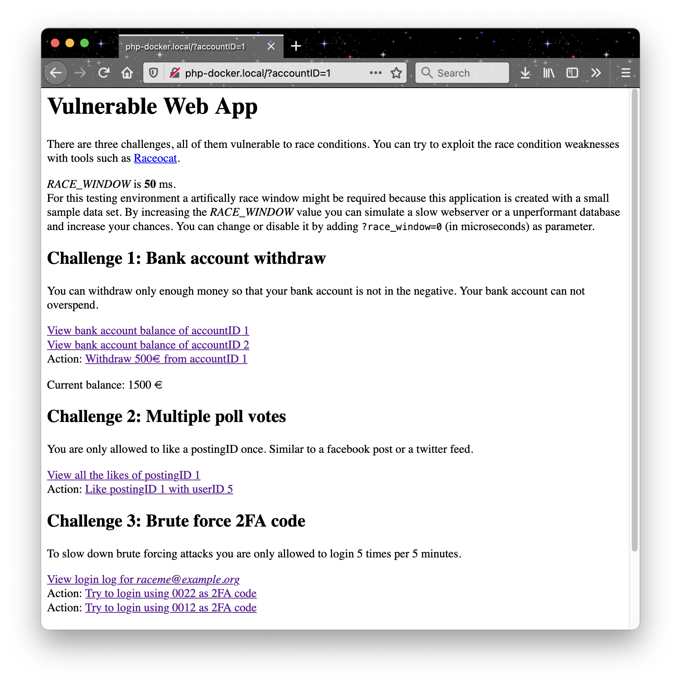

# Web App with Race Condition Vulnerabilities

## Quick start

### Live demo

Live: https://raceocat.yaaw.de/

### Using docker

1. Add `127.0.0.1 php-docker.local` to your `/etc/hosts`
2. Go to `/Raceocat/vuln-webapp/docker/` and execute:

```
docker-compose up -d
```

* `http://php-docker.local:80/index.php` - to access the web app
* `http://localhost:8000` - phpmyadmin, login using `root`/`qwerty` credentials and the host is `mariadb`
* `/docker/init.sql` - the DB dump which is imported

## Screenshots



## Technologies used

* PHP version 7.4.19 (latest 7.* version per time of this writing)
* MariaDB-1:10.5.10 (latest version per time of this writing)

If you take a look into the  `/docker/docker-compose.yml` file to can see which php extensions are required.

## Security

By its design this web application is vulnerable. To make testing more easy
